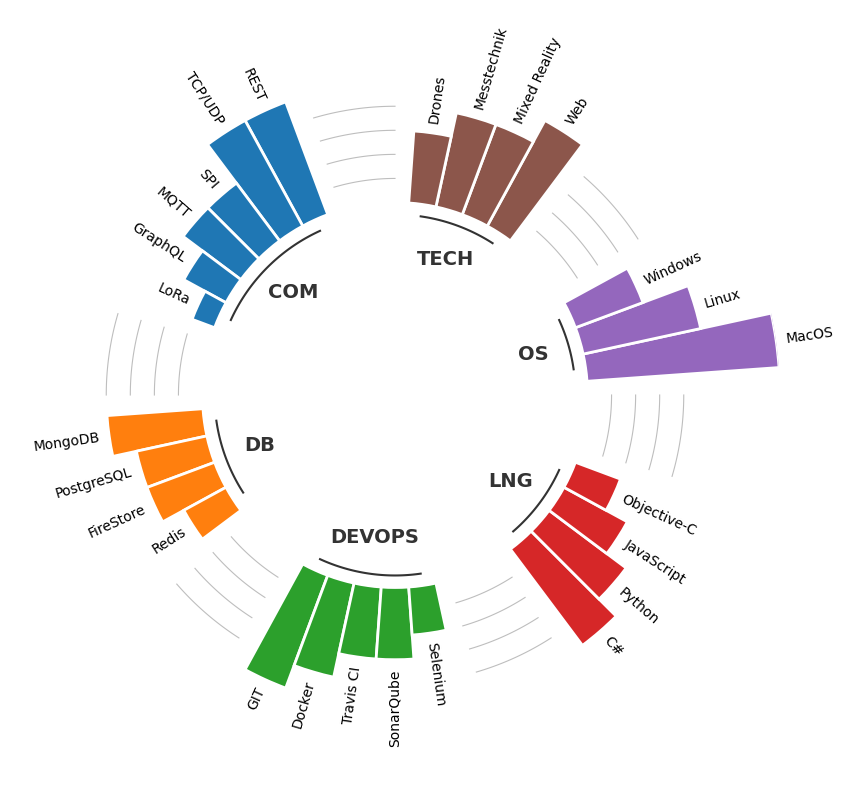

# CV Skill Plot Generator

Use the Jupyter Notebook to generate Radar Skill Plots for your CV.

## Usage

### Run in cloud

- [](https://mybinder.org/v2/gh/develmusa/CV-Skill-Plot-Generator/HEAD?labpath=cv_skill_plot.ipynb)

### Start local instance

1. Install python
2. Install jupyter: ```pip install jupyter```
3. Open Notebook: ```jupyter notebook cv_skill_plot.ipynb```


## Example

